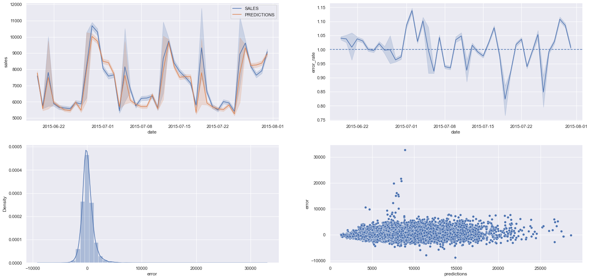

# Rossmann Sales Prediction
Sales forecast using the dataset from this Kaggle competition: https://www.kaggle.com/c/rossmann-store-sales.


## Context of the project
From the description of the Kaggle competition page: 
> "Rossmann operates over 3,000 drug stores in 7 European countries. Currently, Rossmann store managers are tasked with predicting their daily sales for up to six weeks in advance. Store sales are influenced by many factors, including promotions, competition, school and state holidays, seasonality, and locality. With thousands of individual managers predicting sales based on their unique circumstances, the accuracy of results can be quite varied."
## Data Description

- Renaming columns
- Changing data types
- Filling NA
- Statistic description of numerical (mean, median, std, skew, kurtosis) and categorical atributes
##  Exploratory Data Analysis


- Univariate analysis: response, numerical and categorical variables.
- Bivariate analysis: test of hypothesis
- Multivariate analysis: correlation between atributes 
## Data Preparation

- Rescaling: Robust Scaler and Min Max Scaler
- Encoding: One Hot Encoding, Label Encoding and Ordinal Encoding

## Feature Selection

The Boruta algorithm was used to select the features used in the model, you can learn more about the Boruta algorithm here: https://github.com/scikit-learn-contrib/boruta_py
## Model Comparisson & Fine Tuning
On this project, I compared the accuracy of 4 models using k-fold cross validation on each one of them. The results are in the table below.

|Model Name|MAE CV|MAPE CV|RMSE CV|
|----------|------|-------|-------|
|Linear Regression|2081.73 +/- 295.63|0.3 +/- 0.02|2952.52 +/- 468.37|
|Lasso|2116.38 +/- 341.5|0.29 +/- 0.01|3057.75 +/- 504.26|
|Random Forest Regressor|836.63 +/- 217.12|0.12 +/- 0.02|1254.29 +/- 316.19|
|XGBoost Regressor|1064.95 +/- 178.65|0.15 +/- 0.02|1519.92 +/- 242.12|

The model chosen was the XGBoost Regressor because even though it didn't had the best accuracy, it was way less time-consuming when running.

The method chosen to do the fine tuning was the Random Search, and below you have the hyperparemeters chosen for this project.

```
param_tuned = {
    'n_estimators': 3000,
    'eta': 0.03,
    'max_depth': 5,
    'subsample': 0.7,
    'colsample_bytree': 0.7,
    'min_child_weight': 3 
        }
```

## Model Performance Visualization

Here we have the visualization of the model's performance in terms of comparison with the actual sales and how the error behaves.


## Deployment

I built an API that can be requested thru a Telegram bot, where the user can type the store code and receive the prediction of the total sales in the next 6 weeks for the store code sent by the user.

You can check it out @rossmann_tg_bot on Telegram.
